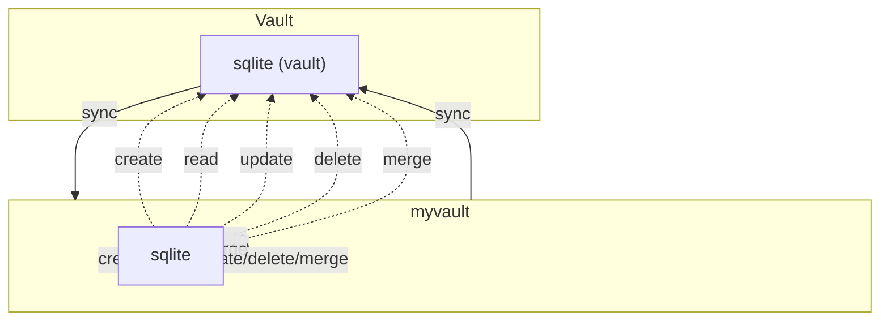

# stordb: Secure Hardware & Secrets Database

stordb is a Python venv application with a SQLite backend and AES256-encrypted Ansible vault storage. It manages hardware MAC addresses, device names, owners, notes, and is extendable to other secrets (usernames, passwords, tokens, keys, etc.).


## How it works


Visual workflow:



See `docs/vault_flowchart.mmd` for the source diagram.

## Features

- Add, lookup, update, and delete hardware MAC addresses and other secrets
- SQLite database backend for fast local operations
- AES256 encryption via Ansible vault for secure storage
- Extensible schema for future secret types
- Secure password handling (env var or prompt)
- Thorough testing with pytest and GitHub Actions
- Robust error handling and validation for all operations
- Sensitive fields (`mac_address`, `secret_value`) are always redacted in logs and CLI output

## Quickstart

1. **Setup environment**

    ```bash
    python3 -m venv venv && source venv/bin/activate
    python3 -m pip install --upgrade pip
    pip3 install -r requirements.txt
    ```

2. **Configure environment variables**
    - Edit `environment.sh` and source it:

        ```bash
        source environment.sh
        ```

3. **Initialize the SQLite database**

    ```bash
    python stordb.py --init
    ```

4. **Run the application with useful commands**

    - Add a device:
        ```bash
        python stordb.py --add 00:11:22:33:44:55 Router Alice "Main router"
        ```
    - Lookup a device by MAC address:
        ```bash
        python stordb.py --lookup 00:11:22:33:44:55
        ```
    - Update a device field:
        ```bash
        python stordb.py --update 1 owner=Bob
        ```
    - Delete a device by ID:
        ```bash
        python stordb.py --delete 1
        ```

5. **Run tests**

    ```bash
    python run_tests.py
    # Or
    python3 -m pytest tests/ -v
    ```

## Testing

- All critical paths, edge cases, and vault operations are covered by automated tests in `tests/`.
- Run `python3 -m pytest tests/ -v` for full coverage and error reporting.

## Error Handling & Validation

- All database and import operations validate required fields and handle malformed input gracefully.
- Errors are logged and reported to the user; the application will not crash on bad input.

## Security

- Only `mac_address` and `secret_value` fields are redacted in logs and CLI output; owner and device name are shown for usability.
- Vault passwords and decrypted secrets are never logged or stored in plaintext.
- All vault operations are robust against subprocess failures and corrupt files.
        python -m pytest tests/ -v
        ```


## Advanced Workflows & Documentation

- [CSV Import Guide](docs/csv_import.md): Bulk import secrets from CSV files
- [Vault Integration Guide](docs/vault_integration.md): Secure export/import with Ansible vault

## Directory Structure

- `stordb.py`         Main application script
- `requirements.txt`  Python dependencies
- `run_tests.py`      Test runner
- `pytest.ini`        Pytest config
- `environment.sh`    Environment setup
- `LICENSE`           MIT License
- `docs/`             Documentation
- `examples/`         Example usage
- `tests/`            All test files
- `.github/`          Copilot instructions, workflows, dependabot

## Security & Conventions

- Never hard-code secrets or passwords
- Use environment variables for credentials
- All vault operations are isolated for testability
- See `.github/copilot-instructions.md` for full conventions


## Troubleshooting

- **Vault export/import errors:**
    - Ensure `ansible-vault` is installed and in your PATH.
    - Use a strong vault password and set `VAULT_PASSWORD` in your environment for automation.
    - If you see decryption/encryption errors, check for file corruption or incorrect password.
    - Temporary files are securely deleted; if you see file-not-found errors, check permissions.

- **CSV/JSON import errors:**
    - Ensure required columns (`owner`, `device name`, `mac address`) are present in your CSV.
    - For JSON, input must be a list of records with required fields.
    - See `tests/test_edge_cases.py` for coverage of malformed input scenarios.

## Extending

- Add new fields to the database schema as needed
- Update tests and documentation for new secret types

## License

MIT License
